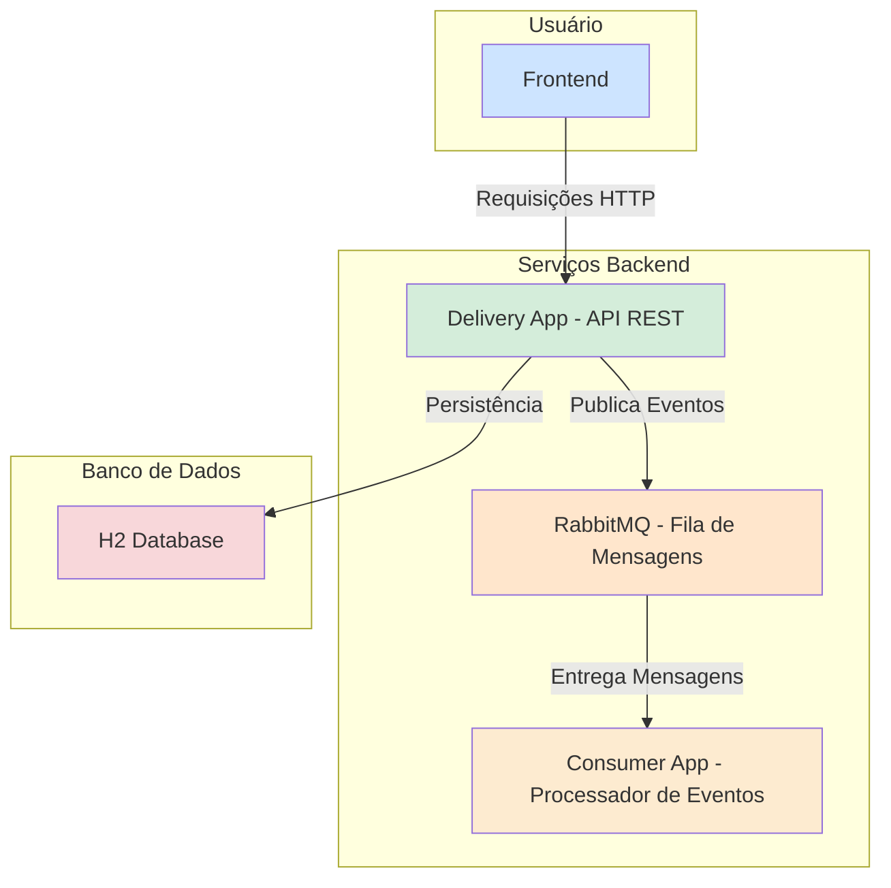

# Delivery App - Backend & Frontend


> **Status do Projeto:** 🚧 Em Desenvolvimento (com foco em fins acadêmicos) 🚧

## 📖 Visão Geral

**Delivery App** é uma aplicação web full-stack que simula um sistema de delivery. O projeto é composto por um backend RESTful robusto construído com Spring Boot e um frontend dinâmico e responsivo. A arquitetura é orientada a eventos, utilizando RabbitMQ para comunicação assíncrona entre componentes.

## ✨ Funcionalidades Principais

-   **Backend RESTful:** API completa para gerenciar Clientes, Restaurantes, Produtos e Pedidos.
-   **Frontend Dinâmico:** Interface de usuário reativa para cadastros (CRUD), realização de pedidos e acompanhamento.
-   **Dashboard de Status:** Painel visual para monitorar a quantidade de pedidos em cada status.
-   **Gerenciamento Avançado:** Tela de gerenciamento de pedidos com filtros dinâmicos, busca e paginação.
-   **Arquitetura Orientada a Eventos:** Notifica mudanças de status de pedidos de forma assíncrona via RabbitMQ.
-   **Documentação Interativa:** API documentada com Swagger (OpenAPI).
-   **Testes Unitários:** Cobertura de testes para a camada de serviço (JUnit 5 & Mockito).

## 🏗️ Arquitetura do Sistema

O sistema é dividido em três componentes principais que se comunicam de forma desacoplada:



## 🛠️ Tecnologias Utilizadas

-   **Backend:** Java 21, Spring Boot 3, Spring Data JPA, Spring AMQP, MapStruct, Lombok.
-   **Frontend:** HTML5, CSS3, JavaScript (ES6+), Bootstrap 5, Tom Select.
-   **Banco de Dados:** H2 (In-Memory).
-   **Mensageria:** RabbitMQ.
-   **Build & Dependências:** Apache Maven.
-   **Testes:** JUnit 5, Mockito.
-   **Ambiente:** Docker.

## 🚀 Como Executar

### Pré-requisitos

-   JDK 21+
-   Apache Maven 3.8+
-   Docker

### Passos

1.  **Clone o repositório:**
    ```bash
    git clone <url-do-seu-repositorio>
    ```

2.  **Inicie o RabbitMQ via Docker:**
    ```bash
    docker run -d --name rabbitmq -p 5672:5672 -p 15672:15672 rabbitmq:3.13-management
    ```
    *Acesse a UI de gerenciamento em `http://localhost:15672` (user: `guest`, pass: `guest`).*

3.  **Execute o Consumidor (`delivery-consumer`):**
    -   Abra o projeto `delivery-consumer` em sua IDE.
    -   Execute a classe principal `ConsumerApplication.java`.
    -   *Este serviço rodará na porta `8081`.*

4.  **Execute a Aplicação Principal (`delivery-app`):**
    -   Abra o projeto `delivery-app` em sua IDE.
    -   Execute a classe principal `DeliveryApplication.java` ou use o Maven:
    ```bash
    mvn spring-boot:run
    ```
    -   *Este serviço rodará na porta `8080`.*

5.  **Acesse a Aplicação:**
    -   Abra seu navegador e acesse: `http://localhost:8080`

## 📝 Endpoints da API

A documentação completa e interativa da API está disponível via Swagger UI. Com a aplicação principal rodando, acesse:

-   **[http://localhost:8080/swagger-ui.html](http://localhost:8080/swagger-ui.html)**

## 🎓 Objetivos Acadêmicos

Este projeto foi desenvolvido com um forte foco educacional, aplicando os cinco princípios **SOLID** no design do backend. Comentários no código-fonte (`// SOLID: ...`) destacam onde cada princípio foi aplicado para facilitar o estudo e a compreensão.